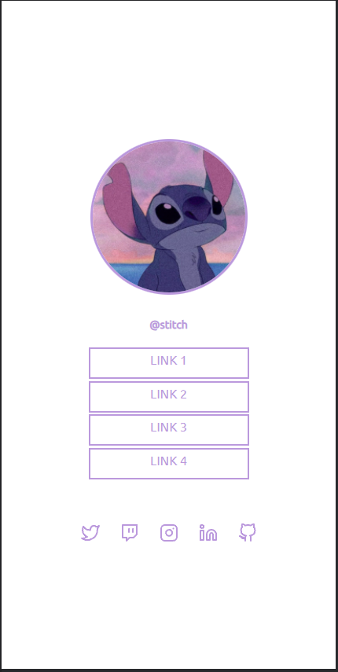

<h1 align="center">Discover Challenges</h1>
 
<h3 align="left">
This repository is the conclusion and unification of all the challenges proposed in Rocketseat's Discover program. A dev training program,
made for you to learn programming from scratch with a focus on web development.
</h2>

<h3 align="left">
There were 600 lessons of great learning, with the incredible didactics of the Mayk Brito and Jakeliny Gracielly, that for sure, took me to the "next level"
as a programming student.
</h2>

--- 

#### 🔗 Try yourself:
https://desafios-discover.vercel.app/

#### 🔗 Discover material link on Notion:
https://quartz-antimony-614.notion.site/Discover-a431f0a838344fb582cc317ed757f143

## 👨‍💻 Technologies

<a href="https://en.wikipedia.org/wiki/HTML">HTML</a>&nbsp;&nbsp;&nbsp;|&nbsp;&nbsp;
<a href="https://www.w3.org/Style/CSS/Overview.en.html">CSS</a>&nbsp;&nbsp;&nbsp;|&nbsp;&nbsp;
<a href="https://www.javascript.com/">JavaScript</a>

  
---  

### 📱 About the mobile

      
    
      

---
  
### 💻 About the desktop

      
    
      

---

<h4 align="center"> <em>&lt;/&gt;</em> by <a href="https://github.com/PhOmena" target="_blank">PhOmena</a> </h4>

